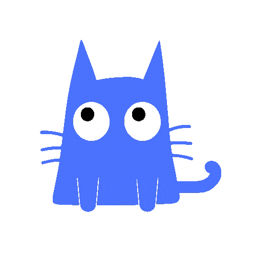

## Hi 👋! I'm Farinaz, a Developer & Product Designer from Toronto!  

🚀 Passionate about building intuitive and scalable digital experiences, I blend design thinking with development to craft impactful products.  

---

### 🛠 Tech Stack  

  
  
  
  
  
  
  
  
  
  
  
  
  
  
  
  
  
  
  
  
  
  
  
  
  
  
  

  

---

### 🛠 Tools  

  
  
  
  
  
  
  
  
  
  
  
  
  

---

### 📬 Connect with Me  

- 💼 **Portfolio:** [farinaz.design](https://www.farinaz.design/)  
- 📧 **Email:** [hello.farinaz@gmail.com](mailto:hello.farinaz@gmail.com)
- 💬 **LinkedIn:** [Farinaz Ebrahimpour](https://www.linkedin.com/in/farinazebrahimpour/)

---

### ✅ What’s New?
📌 Always exploring **new design trends & emerging web technologies** to build engaging experiences.  

🔥 Currently working on **BuddyMD**—stay tuned!  

---

